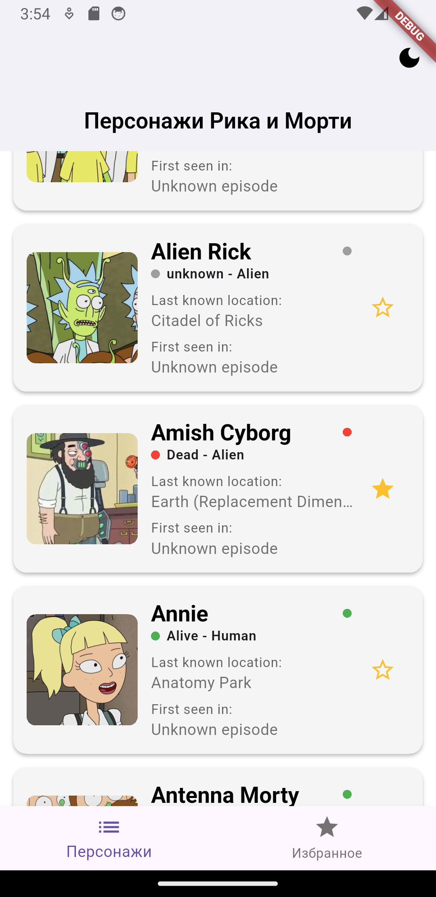
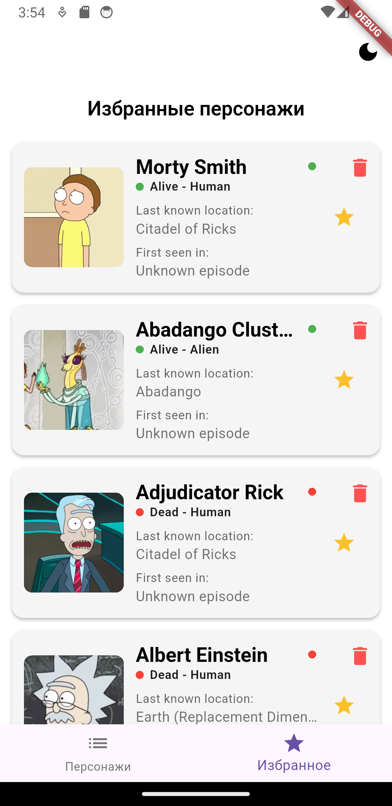
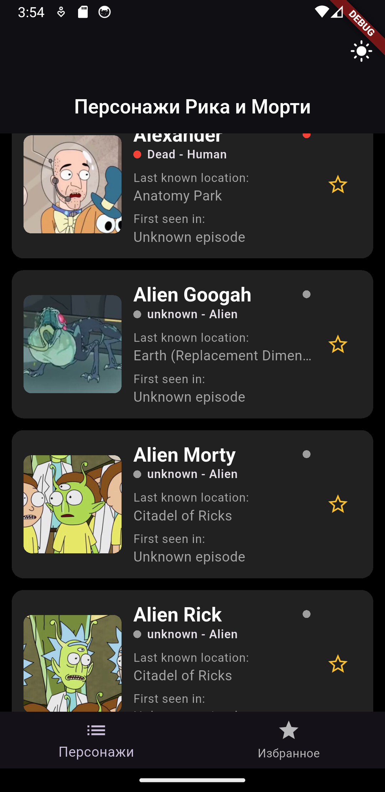

# Rick and Morty Characters App

📱 Мобильное приложение на Flutter, которое позволяет просматривать, добавлять в избранное и кэшировать персонажей мультсериала **"Рик и Морти"**. Использует публичный API [Rick and Morty API](https://rickandmortyapi.com/documentation/).

---

## 🔧 Функциональность

### 🧬 Главный экран
- Список персонажей в виде карточек.
- Карточка содержит:
  - изображение персонажа,
  - имя,
  - статус и вид (`status - species`) с индикатором,
  - текущую локацию,
  - кнопку "звездочка" ⭐ для добавления/удаления из избранного.
- Поддержка бесконечной прокрутки с подгрузкой следующих страниц (пагинация).

### 🌟 Экран избранного
- Список избранных персонажей.
- Те же карточки, что на главном экране.
- Анимация при удалении (мягкое исчезновение).
- Удаление по кнопке 🗑️.
- Избранное хранится локально в базе данных **Drift (SQLite)**.

### 🔁 Кеширование
- Первая страница загружается из локальной базы при оффлайне.
- Все данные автоматически сохраняются в `Drift`.

### 🌗 Темы
- Светлая и тёмная темы с возможностью переключения.
- Темы оформлены через `AppTheme` с использованием Material 3.
- Состояние темы сохраняется в `SharedPreferences`.

### 🧠 Архитектура
- **Чистая архитектура** с разделением на:
  - Data / Domain / Presentation
- **State Management**: Bloc/Cubit
- **DI**: GetIt
- **Работа с сетью**: Dio
- **Локальная БД**: Drift

---

## 📷 Галерея

| Главный экран | Экран избранного | Темная тема |
|---------------|------------------|-------------|
|  |  |  |

> Скриншоты находятся в папке `/screenshots`

---

## 🛠 Технологии

| Категория | Используемое |
|----------|---------------|
| UI       | Flutter (Material 3) |
| State Management | Bloc + Cubit |
| HTTP     | Dio |
| DB       | Drift (SQLite) |
| DI       | GetIt |
| Local storage | SharedPreferences |

---

## ✅ Выполненные требования

- [x] Главный экран с карточками
- [x] Избранное с удалением
- [x] BottomNavigationBar
- [x] Кеширование
- [x] Пагинация
- [x] Хранение избранного в SQLite (Drift)
- [x] Темная тема с переключателем
- [x] Анимации при удалении

---

## 🔗 Ссылки

- [API Документация](https://rickandmortyapi.com/documentation)
- [Drift (SQLite for Dart)](https://drift.simonbinder.eu/)
- [Bloc Library](https://bloclibrary.dev/)

---
